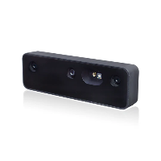
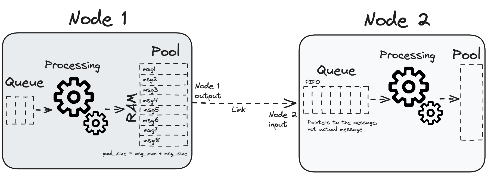

# Process of setting up Luxonis OAK D Pro

### Table of contents
- [Description](#description)
- [DepthAI library](#depthai-library)
- [Scripts (tests)](#scripts-tests)
- [Test platforms](#test-platforms)
## Description
OAK-D Pro is the ultimate camera for robotic vision that perceives the world like a human by combining active stereo depth camera and high-resolution color camera with an on-device Neural Network inferencing and Computer Vision capabilities. It also features night vision for perceiving low-light and no-light environments. OAK-D Pro uses USB-C for both power and USB3 connectivity.

<p align="center">
  
</p>

## DepthAI library
DepthAI API allows users to connect to, configure and communicate with their OAK devices. It supports Python and C++. For more information, check out <a href="https://docs.luxonis.com/software-v3/depthai/">Luxonis Docs</a>.

### Python Installation
Use the pip dependency manager to install API. Perform the below command in your terminal:
```
pip install depthai --force-reinstall
```
Additionaly install OpenCV library:
```
pip install opencv-python
```

### API Components

#### 1. Nodes
Nodes are the building blocks when creating the **Pipeline**. Each node provides its special functionality to the DepthAI API (set of configurable properties and inputs/outputs). You can create nodes on a pipeline and configure/link them however you want.
<p align="center">
  
</p>

Each node can have zero, one or multiple inputs and outputs. For example, SystemLogger node has no inputs and 1 output and EdgeDetector has 2 inputs and 1 output (as shown below). Script node can have any number of inputs/ouputs.

Each node's output has its pool; block in RAM where it stores messages. Each node's input has its queue for message pointers (doesn't store the message itself, just a pointer to it).

#### 2. Pipeline
Pipeline is a collection of Nodes and links between them. This provides lots of the flexibility for the users. 

To get DepthAI up and running, you have to create a pipeline with nodes, create, configure and link them together. After that, pipeline can be loaded onto the Device and be started.

#### 3. Messages
Messages are sent between linked Nodes. The only way nodes communicate with each other is by sending messages from one to another.

#### 4. Device
Device class represents a single Luxonis' hardware device (OAK camera or RAE robot). When starting the device, you have to upload a Pipeline to it, which will get executed on the VPU. When you create the device in the code, firmware is uploaded together with the pipeline and other assets (such as NN blobs).

## Scripts (tests)

### rgb-preview
Initializes camera and shows captured frames. It is the simplest possible application out of all.

> **RGB camera** is a color sensor that works by capturing only one of several primary colors at each photosite in an alternating pattern., using something called CFA (color filter array).
>
> Important is the fact, that each pixel effectively captures only 1/3 of incoming light, since any color not matching the pattern is filtered out.
>
> **RGB model** is currently the most effective additive color model for light, where combining R, G, B light creates matching colors for our eyes.

<p align="center">
  
</p>

### depth-preview
Initializes mono cameras and shows stereo images. It is one of the simplest possible applications to run.
<p align="center">
  
</p>

### mono-previews
Initializes mono cameras and shows stereo images. It is one of the simplest possible applications to run.

> **Monochrome (mono) camera** is capable of higher detail and sensitivity than would otherwise be possible with color. Monochrome sensors capture all incoming light at each pixel regardless of color. Each pixel receives up to 3X more light, since red, green and blue are all absorbed.
>
> Use of monochrome sensors results in lower level of noise and higher resolution. It might be crucial in some cases.

<p align="center">
  
</p>

## Test platforms
We have decided to perform tests on three platforms:
- Windows 11,
- Ubuntu 22.04,
- Jetson Linux.