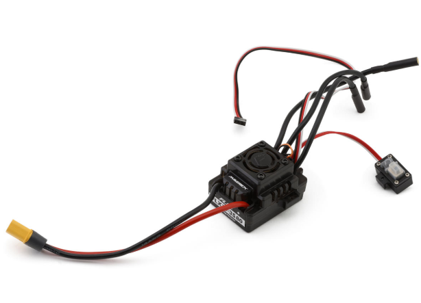
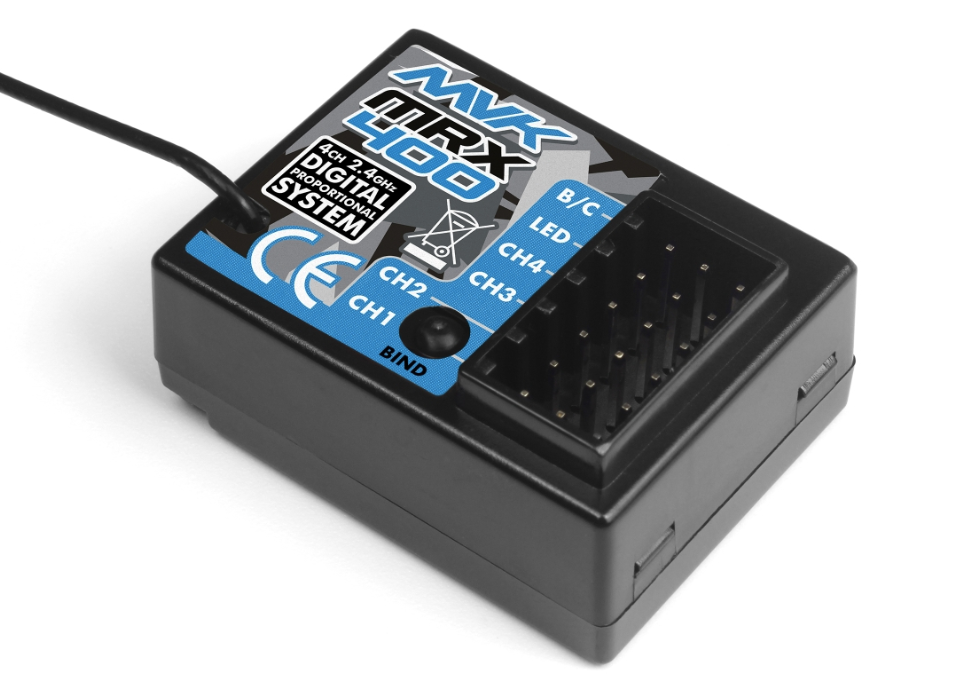

# Process of setting up MAVERICK Quantum2 MT Flux
The Maverick Quantum2 MT Flux 1/10 4WD Brushless Monster Truck is a ready-to-run (RTR) radio-controlled monster truck designed for off-road driving and high-speed “bashing.” It belongs to the Quantum2 RC series and features a strong 4-wheel-drive drivetrain and brushless power system for high performance.

    

## ESC FLX10-3S 80
The FLX10‑3S80 Flux is a brushless electronic speed controller (ESC) designed for 1:10 scale RC cars, especially those in the Maverick Quantum/Quantum2 series. It manages power delivery from the battery to the brushless motor and enables throttle, braking, and reverse control for dynamic driving performance.

    

### Key features
1. **Continuous Current**: 80 A — supports strong acceleration and high speeds.

2. **Input Voltage**: Works with 2S–3S LiPo batteries (7.4 V–11.1 V).

3. **BEC (Built‑in)**: 6 V switching BEC with ~2 A output to power servos/receiver.

4. **Connectors**: XT60 for battery and 4 mm bullet connectors for the motor (depends on version).

5. **Cooling**: Large onboard fan and heatsink help manage heat under load.

6. **Water Resistance**: Designed to tolerate splashes/mud for off‑road use.

## Receiver MRX-400 2.4 GHz
The MRX‑400 2.4 GHz is the radio receiver used in many Maverick Quantum2 series RC cars. It’s the component that sits inside the vehicle and receives the control signals from your radio transmitter, such as throttle and steering commands, then sends them to the ESC (speed controller) and servos.

    

### Channel informations
1. **CH1 (Steering)**:Connects to the steering servo. Signals from the transmitter control the left/right steering of the vehicle.

2. **CH2 (Throttle / ESC)**: Connects to the Electronic Speed Controller (ESC). This channel sends throttle and brake commands from the transmitter. Supplys the power from ESC to the receiver (BEC).

3. **Pin Matrix**: the first row on left is signal, the second is voltage and the last is ground.