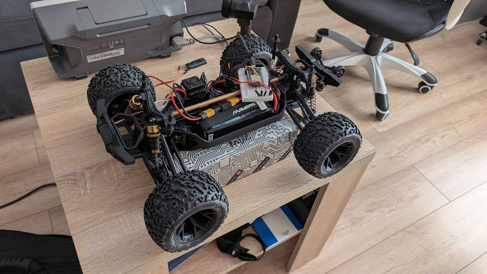

# Reverse Engineering of Control Signals
The goal is to understand how the RC interprets control signals from the transmitter and receiver by capturing the **PWM (pulse-width-modulation)** signals sent to the *ESC (throttle)* and *servo (steering)*. This allows us to analyze voltage levels and behaviour under different inputs.

### What is PWM?
Pulse-width modulation (PWM) is a technique used to control the average power delivered to an electrical load by varying the width of the pulses in a digital signal. It is commonly used in applications like motor control, LED dimming, and power regulation.

### RC PWM (FLX10 ESC)
It's a technical standard for electronic speed controlers (ESCs) which is different from the power-delivery PWM used for e.g. LEDs. Standard RC signals operate at a 50Hz frequency (a 20ms period). In this case pulse width differs from 1.0 ms to 2.0 ms. The signal should be 3.3V. We change the pulse width in order to manipulate the steering and throttle.

### Steering pulse widths
| Turn max left | No turning | Turn max right |
|-|-|-|
|  |  | |
| <p align="center">2100 µs</p> | <p align="center">1500 µs</p> | <p align="center">1020 µs</p> |  

### Throttle pulse widths
| Move max forward | No move | Move max backward |
|-|-|-|
|  |  |  |
| <p align="center">1675 µs</p> | <p align="center">1495 µs</p> | <p align="center">1125 µs</p> |  

## Test sketches
Initial tests required from us to use microcontroller that can create output of 3.3V, in order to fulfill this requirement we used **ESP32**. Additionally we needed a few cables and breadboard.

<p align="center">
    
</p>

### Servo handling
This test verifies the steering servo's range of motion and identifies the physical center point ("trim"). By utilizing a 50Hz PWM signal, we determine the specific microsecond limits that allow for maximum steering throw without causing mechanical binding or straining the linkage.

<p align="center">
    
</p>

### ESC handling
This test validates the Electronic Speed Controller (ESC) logic, specifically focusing on the "Double-Tap" safety sequence required to engage reverse gear on the Flux AC 80A. The goal is to synchronize the STOP_PWM and directional thresholds with the ESP32’s 14-bit resolution to ensure reliable transitions between braking, neutral, and backward motion.

<p align="center">
    
</p>

### ESC Servo control
During the development and calibration phase, we implemented a JSON API to allow for easy testing via web servers or high-level computer scripts. This allowed us to validate the mapping logic before moving to a high-speed production environment.

#### JSON control packet
```
{"steering": 90, "throttle": 0}
```
| Component | Range |
| ----------|-------|
| Steering  | -100 to 100 |
| Throttle  | -1, 0, 1|

> **Important**: In the final production firmware, we moved away from JSON to a raw binary packet structure to minimize latency and CPU overhead on the ESP32.