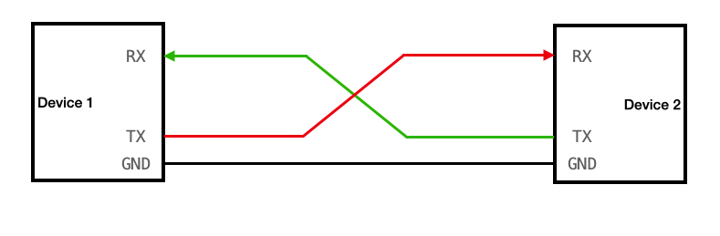

# Serial Communication
Serial communication sends data one bit at a time over a communication line. It’s widely used in systems like microcontrollers, CNC machines, and 3D printers.

    

## Communication Protocol
The system uses a custom, lightweight binary packet for high-frequency control. By using a "packed" structure, we eliminate compiler-added padding and ensure 1:1 memory mapping between the PC (Master) and the ESP32 (Slave).

### Packet structure
The control packet is exactly 4 bytes long.

| Byte | Field | Type | Description |
|---|---|---|---|
| 0 | Header | uint8_t | Constant 0xAA |
| 1 | Steering| int8_t | -100 (L) to 100 (R) |
| 2 | Throttle| int8_t | -1 (B), 0 (N), 1 (F) |
| 3 | Checksum| uint8_t | XOR of Bytes 0, 1, 2 |

### Data Integrity (Checksum)
To prevent motor jitters caused by serial noise, every packet is verified using a bitwise XOR checksum. The receiver calculates the checksum of the first three bytes and compares it to the fourth byte. If they do not match, the packet is discarded.

### Code
Code has been divided into two folders master and slave. Where master is a computer's script and the slave is ESP32's script. 