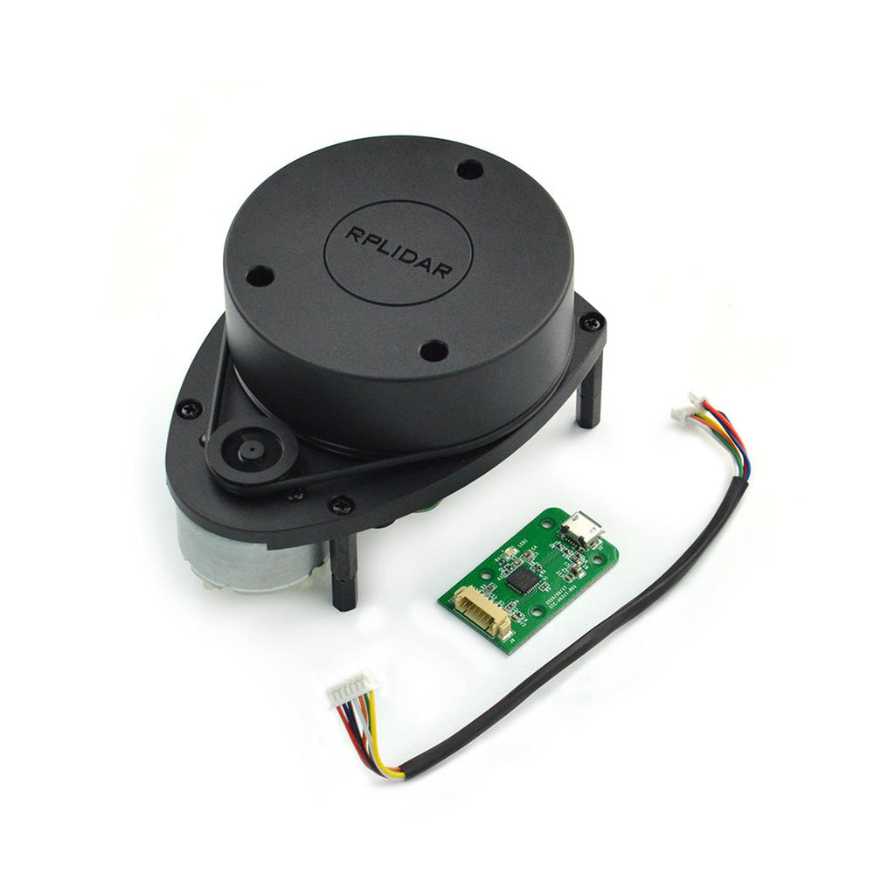

# Process of setting up Slamtec Rplidar A1M8

### Table of contents
- [Description](#description)
- [Lidar library](#lidar-library)
- [Scripts (tests)](#scripts-tests)
- [Test platforms](#test-platforms)

## Description
The RPLIDAR A1M8 is a low-cost, high-performance 2D laser scanner (LIDAR) solution developed by SLAMTEC. It is designed to provide robots with 360-degree environmental awareness, making it a staple in the world of autonomous navigation and SLAM (Simultaneous Localization and Mapping).

<p align="center">
  
</p>

## Lidar library

### Python Installation
Use the pip dependency manager to install API. Perform the below command in your terminal:
```
pip install rplidar
```
Also install pygame library for visualization:
```
pip install pygame
```

## Scripts (tests)

### Example usage 
Default test script to test lidar functionalities (starting, reading, closing). It has extended timeout to 1.2 seconds, this means that computer will wait for response from lidar for 1.2 seconds during e.g. checking health, reading data.

> **IMPORTANT:** you need to set your PORT_NAME constant, to do this open device manager and check if you see some name that would suggest that it is a lidar. 
<p align="center">
  
</p>


### Visualization of measurements 
Visualization of lidar measurements on the screen using pygame library. It's important to know how lidar sees environment.

> **Pygame** is a cross-platform set of Python modules designed for writing video games. It includes computer graphics and sound libraries designed to be used with the Python programming.

> **IMPORTANT:** you need to set your PORT_NAME constant, to do this open device manager and check if you see some name that would suggest that it is a lidar. 
<p align="center">
  
</p>

## Test platforms
We have decided to perform tests on three platforms:
- Windows 11,
- Ubuntu 22.04,
- Jetson Linux.